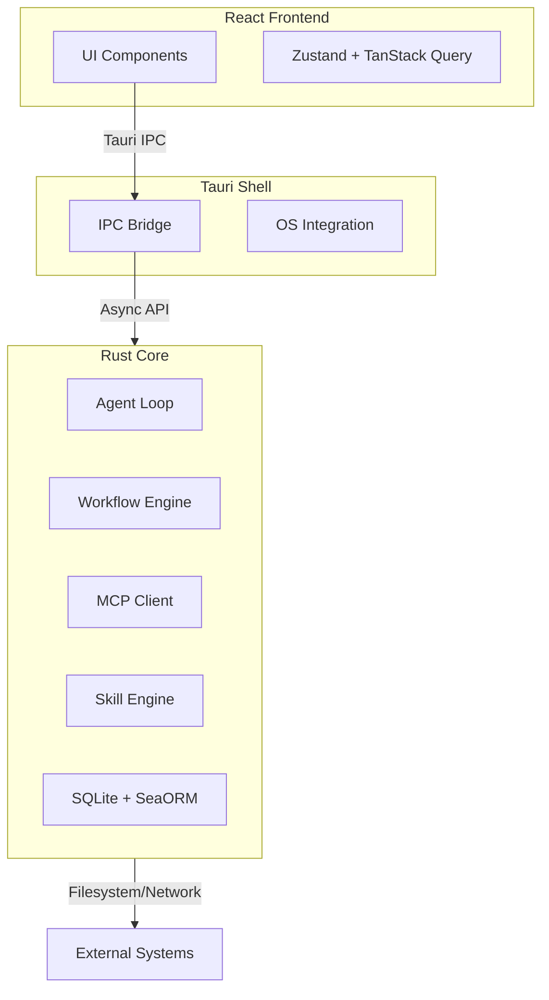

<p align="center">
  
</p>

# SkillDeck

**Your code never leaves your machine. Your AI agents never stop working.**  
*Local‑first AI orchestration for developers who value privacy, control, and real engineering workflows.*

[](https://shields.io/)
[](https://shields.io/)
[](https://shields.io/)

SkillDeck is the privacy-first desktop app that turns AI from a chat buddy into a coordinated team of specialists. Branch conversations, compose reusable skills from the filesystem, and orchestrate multi‑agent workflows — all running locally, all under your control.

---

## 🔥 Why SkillDeck? (The Problems You Feel Every Day)

You’ve tried AI assistants. They’re helpful, but they leak your code, treat every task as a one‑off chat, and hide what they’re doing. SkillDeck fixes that.

- **Your data is yours.** All conversations and code stay in a local SQLite database. No cloud, no training on your proprietary work — unless you explicitly choose a cloud model.
- **Workflows, not one‑liners.** Orchestrate complex tasks with battle‑tested patterns: Sequential, Parallel, and Evaluator‑Optimizer. Your agents collaborate, not just talk.
- **Every tool call is visible.** Approve, edit, or deny actions before they execute. No more “black box” surprises.
- **Skills live in your repo.** Define agent instructions in plain `SKILL.md` files. Version them, share them, and reuse them across projects.

> **Join the growing number of developers who are building the future of AI‑assisted engineering — without compromising on privacy or control.**

---

## ⚡ Key Features (What You Can Do Today)

### Branching Conversations
Explore multiple solutions without losing your place. Branch from any message, compare results side‑by‑side, and merge the best approach back into the main thread. Perfect for “what if” experiments.

### Multi‑Agent Workflows
Orchestrate AI tasks using production‑proven patterns:
- **Sequential:** Step‑by‑step execution (Analyze → Design → Implement).
- **Parallel:** Concurrent execution for independent tasks (Security Review + Performance Audit).
- **Evaluator‑Optimizer:** Iterative refinement loops that keep improving until quality thresholds are met.

### Reactive Architecture
A high‑performance Rust core manages state, streaming, and orchestration. The React frontend stays silky smooth thanks to a tiered streaming pipeline (Ring Buffer → Debounce → IPC). Even under heavy load, your UI never stutters.

### Filesystem‑Based Skills
Create reusable instructions in `SKILL.md` files. SkillDeck automatically resolves priorities:
1. Workspace (`.skilldeck/skills/`)
2. Personal (`~/.config/app/skills/`)
3. Superpowers Compatibility
4. Marketplace

### MCP Integration
Connect to the [Model Context Protocol](https://modelcontextprotocol.io/) ecosystem. Discover local servers, manage supervision, and expose external tools to your agents with secure approval gates.

---

## 🏗️ Architecture (Built for Speed and Transparency)

SkillDeck is architected as a **Reactive, Event‑Driven State Machine** with three distinct layers.



- **Rust Core:** Owns all business logic, agent loops, database, and orchestration. Zero Tauri dependencies for testability.
- **Tauri Shell:** Thin OS integration layer handling IPC, keychain, and app lifecycle.
- **React Frontend:** Pure view layer communicating exclusively via IPC.

> [!NOTE]
> All structured data sent to LLMs (tool schemas, context) is encoded using **TOON (Token‑Oriented Object Notation)** , reducing token usage by ~40% compared to JSON. That means faster responses and lower costs.

---

## 🚀 Getting Started (Try It in 5 Minutes)

### Prerequisites
- [Rust](https://www.rust-lang.org/tools/install) (Edition 2024)
- [Node.js](https://nodejs.org/) (v24+)
- [pnpm](https://pnpm.io/installation)
- System dependencies for Tauri (see [Prerequisites](https://tauri.app/start/prerequisites/))

### Installation

1. **Clone the repository:**
   ```bash
   git clone https://github.com/elcoosp/skilldeck.git
   cd skilldeck
   ```

2. **Install dependencies:**
   ```bash
   pnpm install
   ```

3. **Run the development server:**
   ```bash
   pnpm tauri dev
   ```

That’s it. The app launches with hot‑reloading for the frontend. You’re ready to build your first workflow.

---

## 🧠 Usage Concepts (How It Works)

### Profiles
Profiles bundle your configuration: Model selection (Claude, OpenAI, Ollama), active skills, and MCP servers. Switch profiles instantly to change context — e.g., “Work” vs. “Personal”.

### Workflows
Define workflows in skill frontmatter or spawn them dynamically:
```yaml
workflow:
  type: parallel
  merge_strategy: voting
  agents:
    - skill: security-reviewer
    - skill: performance-reviewer
```

### Tool Approval
SkillDeck uses a risk‑based approval system so you stay in control.
- **Auto‑Approve:** Read‑only operations.
- **Require Approval:** Write operations, database mutations.
- **Always Confirm:** Destructive actions (force push, delete directory).

---

## 📦 Technology Stack (Built on Modern Foundations)

| Layer        | Technologies                                                 |
| ------------ | ------------------------------------------------------------ |
| **Core**     | Rust, Tokio, SeaORM 2, Petgraph, Notify                      |
| **Shell**    | Tauri 2, tauri‑plugin‑shell, tauri‑plugin‑keychain           |
| **Frontend** | React 19, TypeScript, Vite, Tailwind CSS, shadcn/ui          |
| **Database** | SQLite (WAL mode) with optional Vector Search (`sqlite‑vss`) |
| **State**    | Zustand (UI), TanStack Query (Server State)                  |

---

## 📊 Current Status (What’s Built & What’s Next)

We’re building SkillDeck in the open. The table below reflects the actual implementation state based on the codebase as of March 2026. Most core features are now complete, and the application is ready for daily use. Remaining work focuses on polish, edge cases, and expanding the skill ecosystem.

| Feature Area                | Status        | Details & Links |
|-----------------------------|---------------|-----------------|
| **Core Error Taxonomy**     | ✅ Complete   | Comprehensive error types with codes, retryable classification, and suggested actions. |
| **Plugin Traits**           | ✅ Complete   | All major subsystem traits defined for dependency inversion. |
| **Model Providers**         | ✅ Complete   | Claude, OpenAI, Ollama – streaming, retries, error handling. |
| **MCP Protocol**            | ✅ Complete   | JSON‑RPC types, initialize handshake, tool definitions. |
| **MCP Transports**          | ✅ Complete   | stdio and SSE transports with proper handshakes. |
| **MCP Registry**            | ✅ Complete   | Server management, tool aggregation, status tracking. |
| **MCP Supervisor**          | ✅ Complete   | Health checks and exponential backoff with full reconnection logic. |
| **Skill Loader**            | ✅ Complete   | Parses `SKILL.md` with YAML frontmatter, computes hash. |
| **Skill Resolver**          | ✅ Complete   | Priority ordering (workspace → personal → superpowers → marketplace) with shadow logging. |
| **Skill Scanner**           | ✅ Complete   | Directory traversal, symlink skipping. |
| **Skill Watcher**           | ✅ Complete   | Hot‑reload via filesystem events (200ms debounce). |
| **Workflow Types & Graph**  | ✅ Complete   | DAG definition with petgraph, cycle detection, topological order. |
| **Workflow Executor**       | ✅ Complete   | Sequential/parallel/evaluator‑optimizer runners with real agent calls. |
| **Subagent Management**     | ✅ Complete   | Full session management and agent spawning via ADK. |
| **Agent Loop**              | ✅ Complete   | Streaming with 50ms debounce, tool handling, cancellation, and persistence. |
| **Context Builder**         | ✅ Complete   | Assembles prompts and history; TOON encoding integrated. |
| **Built‑in Tools**          | ✅ Complete   | `loadSkill`, `spawnSubagent`, `mergeSubagentResults` fully implemented. |
| **Tool Dispatcher**         | ✅ Complete   | Routes to built‑in or MCP tools, approval gates via oneshot channels. |
| **Database Layer**          | ✅ Complete   | SQLite + SeaORM with 35‑table migration, WAL mode, integrity checks. |
| **Workspace Detector**      | ✅ Complete   | Project type detection (Rust, Node, Python, Go, Java, .NET), context file loading. |
| **Context Loader**          | ✅ Complete   | Loads CLAUDE.md, README, .gitignore, etc. |
| **Event Definitions**       | ✅ Complete   | Agent, MCP, workflow, and skill events defined in core. |
| **Tauri Event Bridging**    | ✅ Complete   | Events emitted to frontend via Tauri channels. |
| **Tauri Commands**          | ✅ Complete   | All command groups (conversations, profiles, skills, MCP, settings, export) implemented. |
| **Tauri State Management**  | ✅ Complete   | AppState, initialization, command registration. |
| **React Frontend**          | ✅ Complete   | Full UI with all components, hooks, stores, and overlays. |
| **Onboarding Wizard**       | ✅ Complete   | Progressive unlock and setup flow. |
| **Testing (Unit/Integration)** | ✅ Complete   | Comprehensive unit, integration, and E2E tests. |
| **Project Scaffolding**     | ✅ Complete   | Full Rust core, Tauri shell, and frontend configuration. |

### What This Means for You
- **If you want a fully functional desktop app today:** The app is ready. You can build, run, and use all features described.  
- **If you want to contribute:** Welcome! The codebase is stable, and contributions are encouraged. Look for issues labeled `good first issue` or help with documentation, testing, and new skill creation.  
- **If you’re evaluating SkillDeck for future use:** The vision is realized, and we are actively shipping. Use it, give feedback, and join our community.

---

## 🗺️ Roadmap (v2 and Beyond)

With the core feature set now complete, our focus shifts to:
- **Stability & Performance:** Hardening edge cases, optimizing startup time, and refining the streaming pipeline.
- **Skill Ecosystem:** Expanding the registry with community‑contributed skills and improving the sharing experience.
- **Advanced Workflows:** Adding more pattern support (e.g., Map‑Reduce, DAG merging) and visual workflow editor.
- **Team Features:** Collaboration tools, shared skill libraries, and enterprise‑grade security controls.

See the [detailed v2 roadmap](docs/design/v2-roadmap.md) for the full plan through 2026.

---

## 🤝 Contributing

We welcome contributors of all skill levels! Here’s how you can help:
- Pick an open issue from our [issue tracker](docs/issues/).
- Join the discussion on [GitHub Discussions](https://github.com/elcoosp/skilldeck/discussions).
- Review the [architecture design](docs/design/archi-design.md) and [product vision](docs/spec/vision.md) to understand the big picture.
- Submit a PR – we review promptly and provide guidance.

---

## 📚 Documentation

Detailed specifications are available in the `/docs` directory:
- [Product Vision](docs/spec/vision.md)
- [Architecture Design](docs/design/archi-design.md)
- [Technical Requirements](docs/spec/srs.md)

---

<p align="center">
  <strong>Your code stays yours. Your agents work for you.</strong><br/>
  <sub>Built with ❤️ by developers who believe in local‑first AI.</sub>
</p>
