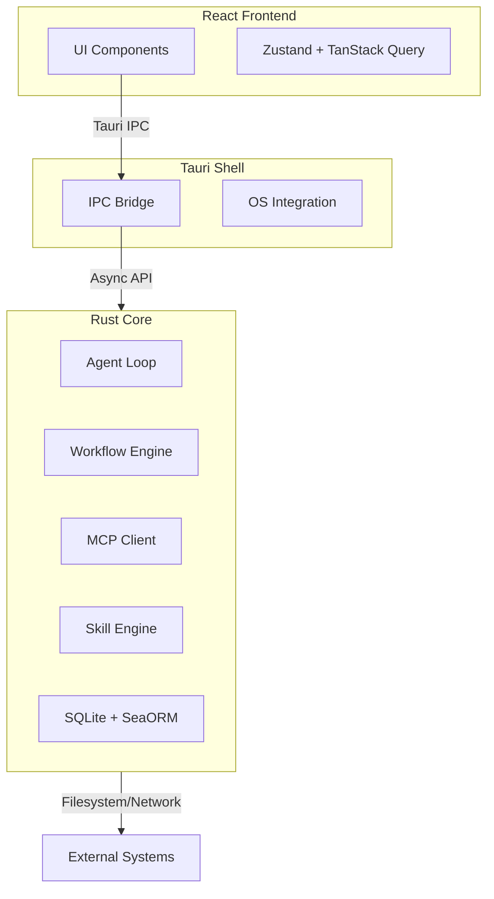

<p align="center">
  
</p>

# SkillDeck

**Local-first AI Orchestration for Developers**

[](https://shields.io/)
[](https://shields.io/)
[](https://shields.io/)

SkillDeck is a privacy-respecting desktop application that transforms AI from a single chat partner into a coordinated team of specialized collaborators. Built with Tauri and Rust, it offers branching conversations, filesystem-based composable skills, and multi-agent workflow orchestration — all running locally on your machine.

---

## Why SkillDeck?

Modern AI assistants often fall short for serious engineering work due to cloud dependency, single-threaded interactions, and opaque tooling. SkillDeck addresses these challenges:

- **Data Sovereignty:** All data stays local in SQLite. Your code and conversations never leave your machine unless you choose to use cloud models.
- **Workflow Complexity:** Orchestrate complex tasks using Sequential, Parallel, and Evaluator-Optimizer patterns, moving beyond simple chat.
- **Transparent Tooling:** Every tool call is visible. Approve, edit, or deny actions before execution.
- **Portable Skills:** Define skills as simple `SKILL.md` files. Version control them, share them, and compose them across projects.

---

## Key Features

### 🌳 Branching Conversations

Explore multiple solutions simultaneously without losing context. Branch from any message, compare results side-by-side, and merge the best approach back into the main thread.

### 🤖 Multi-Agent Workflows

Orchestrate AI tasks using production-proven patterns:

- **Sequential:** Step-by-step execution (Analyze → Design → Implement).
- **Parallel:** Concurrent execution for independent tasks (Security Review + Performance Audit).
- **Evaluator-Optimizer:** Iterative refinement loops to achieve quality thresholds.

### ⚡ Reactive Architecture

A high-performance Rust core manages state, streaming, and orchestration, wrapped in a reactive React frontend. The system uses a tiered streaming pipeline (Ring Buffer → Debounce → IPC) to ensure UI responsiveness under load.

### 📂 Filesystem-Based Skills

Create reusable instructions in `SKILL.md` files. SkillDeck resolves priorities automatically:

1. Workspace (`.skills/`)
2. Personal (`~/.config/app/skills/`)
3. Superpowers Compatibility
4. Marketplace

### 🔗 MCP Integration

Connect to the [Model Context Protocol](https://modelcontextprotocol.io/) ecosystem. Discover local servers, manage supervision, and expose external tools to your agents with secure approval gates.

---

## Architecture

SkillDeck is architected as a **Reactive, Event-Driven State Machine** with three distinct layers.



- **Rust Core:** Owns all business logic, agent loops, database, and orchestration. Zero Tauri dependencies for testability.
- **Tauri Shell:** Thin OS integration layer handling IPC, keychain, and app lifecycle.
- **React Frontend:** Pure view layer communicating exclusively via IPC.

> [!NOTE]
> All structured data sent to LLMs (tool schemas, context) is encoded using **TOON (Token-Oriented Object Notation)**, reducing token usage by ~40% compared to JSON.

---

## Getting Started

### Prerequisites

- [Rust](https://www.rust-lang.org/tools/install) (Edition 2024)
- [Node.js](https://nodejs.org/) (v18+)
- [pnpm](https://pnpm.io/installation)
- System dependencies for Tauri (see [Prerequisites](https://tauri.app/v1/guides/getting-started/prerequisites))

### Installation

1. **Clone the repository:**

   ```bash
   git clone https://github.com/elcoosp/skilldeck.git
   cd skilldeck
   ```

2. **Install dependencies:**

   ```bash
   pnpm install
   ```

3. **Run the development server:**
   ```bash
   pnpm tauri dev
   ```

This launches the desktop app with hot-reloading for the frontend.

---

## Usage Concepts

### Profiles

Profiles bundle your configuration: Model selection (Claude, OpenAI, Ollama), active skills, and MCP servers. Switch profiles instantly to change context (e.g., "Work" vs. "Personal").

### Workflows

Define workflows in skill frontmatter or spawn them dynamically:

```yaml
workflow:
  type: parallel
  merge_strategy: voting
  agents:
    - skill: security-reviewer
    - skill: performance-reviewer
```

### Tool Approval

SkillDeck uses a risk-based approval system.

- **Auto-Approve:** Read-only operations.
- **Require Approval:** Write operations, database mutations.
- **Always Confirm:** Destructive actions (force push, delete directory).

---

## Technology Stack

| Layer        | Technologies                                                 |
| ------------ | ------------------------------------------------------------ |
| **Core**     | Rust, Tokio, SeaORM 2, Petgraph, Notify                      |
| **Shell**    | Tauri 2, tauri-plugin-shell, tauri-plugin-keychain           |
| **Frontend** | React 19, TypeScript, Vite, Tailwind CSS, shadcn/ui          |
| **Database** | SQLite (WAL mode) with optional Vector Search (`sqlite-vss`) |
| **State**    | Zustand (UI), TanStack Query (Server State)                  |

---

## Roadmap

SkillDeck v1 focuses on local-first stability and workflow orchestration.

- [x] Core Agent Loop with Streaming
- [x] Branching Conversation Model
- [x] Filesystem Skill Resolution
- [ ] Multi-Agent Workflow Engine
- [ ] MCP Server Discovery & Supervision
- [ ] Workspace Context Injection

Future versions (v2+) will explore cloud sync and visual workflow editors.

---

## Documentation

Detailed specifications are available in the `/docs` directory:

- [Product Vision](docs/spec/vision.md)
- [Architecture Design](docs/design/archi-design.md)
- [Technical Requirements](docs/spec/srs.md)
