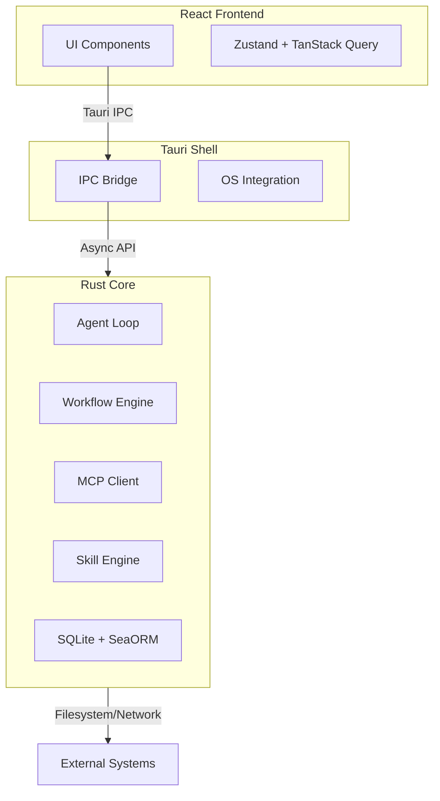

<p align="center">
  
</p>

# SkillDeck

**Your code never leaves your machine. Your AI agents never stop working.**  
*Local‑first AI orchestration for developers who value privacy, control, and real engineering workflows.*

[](https://shields.io/)
[](https://shields.io/)
[](https://shields.io/)

SkillDeck is the privacy-first desktop app that turns AI from a chat buddy into a coordinated team of specialists. Branch conversations, compose reusable skills from the filesystem, and orchestrate multi‑agent workflows — all running locally, all under your control.

---

## 🔥 Why SkillDeck? (The Problems You Feel Every Day)

You’ve tried AI assistants. They’re helpful, but they leak your code, treat every task as a one‑off chat, and hide what they’re doing. SkillDeck fixes that.

- **Your data is yours.** All conversations and code stay in a local SQLite database. No cloud, no training on your proprietary work — unless you explicitly choose a cloud model.
- **Workflows, not one‑liners.** Orchestrate complex tasks with battle‑tested patterns: Sequential, Parallel, and Evaluator‑Optimizer. Your agents collaborate, not just talk.
- **Every tool call is visible.** Approve, edit, or deny actions before they execute. No more “black box” surprises.
- **Skills live in your repo.** Define agent instructions in plain `SKILL.md` files. Version them, share them, and reuse them across projects.

> **Join the growing number of developers who are building the future of AI‑assisted engineering — without compromising on privacy or control.**

---

## ⚡ Key Features (What You Can Do Today)

### Branching Conversations
Explore multiple solutions without losing your place. Branch from any message, compare results side‑by‑side, and merge the best approach back into the main thread. Perfect for “what if” experiments.

### Multi‑Agent Workflows
Orchestrate AI tasks using production‑proven patterns:
- **Sequential:** Step‑by‑step execution (Analyze → Design → Implement).
- **Parallel:** Concurrent execution for independent tasks (Security Review + Performance Audit).
- **Evaluator‑Optimizer:** Iterative refinement loops that keep improving until quality thresholds are met.

### Reactive Architecture
A high‑performance Rust core manages state, streaming, and orchestration. The React frontend stays silky smooth thanks to a tiered streaming pipeline (Ring Buffer → Debounce → IPC). Even under heavy load, your UI never stutters.

### Filesystem‑Based Skills
Create reusable instructions in `SKILL.md` files. SkillDeck automatically resolves priorities:
1. Workspace (`.skills/`)
2. Personal (`~/.config/app/skills/`)
3. Superpowers Compatibility
4. Marketplace

### MCP Integration
Connect to the [Model Context Protocol](https://modelcontextprotocol.io/) ecosystem. Discover local servers, manage supervision, and expose external tools to your agents with secure approval gates.

---

## 🏗️ Architecture (Built for Speed and Transparency)

SkillDeck is architected as a **Reactive, Event‑Driven State Machine** with three distinct layers.



- **Rust Core:** Owns all business logic, agent loops, database, and orchestration. Zero Tauri dependencies for testability.
- **Tauri Shell:** Thin OS integration layer handling IPC, keychain, and app lifecycle.
- **React Frontend:** Pure view layer communicating exclusively via IPC.

> [!NOTE]
> All structured data sent to LLMs (tool schemas, context) is encoded using **TOON (Token‑Oriented Object Notation)** , reducing token usage by ~40% compared to JSON. That means faster responses and lower costs.

---

## 🚀 Getting Started (Try It in 5 Minutes)

### Prerequisites
- [Rust](https://www.rust-lang.org/tools/install) (Edition 2024)
- [Node.js](https://nodejs.org/) (v24+)
- [pnpm](https://pnpm.io/installation)
- System dependencies for Tauri (see [Prerequisites](https://tauri.app/v1/guides/getting-started/prerequisites))

### Installation

1. **Clone the repository:**
   ```bash
   git clone https://github.com/elcoosp/skilldeck.git
   cd skilldeck
   ```

2. **Install dependencies:**
   ```bash
   pnpm install
   ```

3. **Run the development server:**
   ```bash
   pnpm tauri dev
   ```

That’s it. The app launches with hot‑reloading for the frontend. You’re ready to build your first workflow.

---

## 🧠 Usage Concepts (How It Works)

### Profiles
Profiles bundle your configuration: Model selection (Claude, OpenAI, Ollama), active skills, and MCP servers. Switch profiles instantly to change context — e.g., “Work” vs. “Personal”.

### Workflows
Define workflows in skill frontmatter or spawn them dynamically:
```yaml
workflow:
  type: parallel
  merge_strategy: voting
  agents:
    - skill: security-reviewer
    - skill: performance-reviewer
```

### Tool Approval
SkillDeck uses a risk‑based approval system so you stay in control.
- **Auto‑Approve:** Read‑only operations.
- **Require Approval:** Write operations, database mutations.
- **Always Confirm:** Destructive actions (force push, delete directory).

---

## 📦 Technology Stack (Built on Modern Foundations)

| Layer        | Technologies                                                 |
| ------------ | ------------------------------------------------------------ |
| **Core**     | Rust, Tokio, SeaORM 2, Petgraph, Notify                      |
| **Shell**    | Tauri 2, tauri‑plugin‑shell, tauri‑plugin‑keychain           |
| **Frontend** | React 19, TypeScript, Vite, Tailwind CSS, shadcn/ui          |
| **Database** | SQLite (WAL mode) with optional Vector Search (`sqlite‑vss`) |
| **State**    | Zustand (UI), TanStack Query (Server State)                  |

---

## 📊 Current Status (What’s Built & What’s Next)

We’re building SkillDeck in the open. Here’s the exact state of development based on our [issue tracker](docs/issues/). Use this to decide if SkillDeck meets your needs today—and where you can help.

| Feature Area                | Status        | Details & Links |
|-----------------------------|---------------|-----------------|
| **Core Error Taxonomy**     | ✅ Complete   | All error variants with unique codes, retryable classification, and suggested actions. [#8](docs/issues/implement-core-error-types-and-error-taxonomy.md) |
| **Plugin Traits**           | ✅ Complete   | Traits for model providers, MCP, skill loading, database, sync (v2). [#1](docs/issues/define-plugin-traits-for-dependency-inversion.md) |
| **Model Providers**         | ✅ Complete   | Claude, OpenAI, Ollama – streaming, retries, error handling. [#4](docs/issues/implement-claude-model-provider.md), [#16](docs/issues/implement-ollama-model-provider.md), [#18](docs/issues/implement-openai-model-provider.md) |
| **MCP Protocol**            | ✅ Complete   | JSON‑RPC types, initialize handshake, tool definitions. [#15](docs/issues/implement-mcp-types-and-json-rpc-protocol.md) |
| **MCP Transports**          | ✅ Complete   | stdio (local) and SSE (remote) transports with proper handshakes. [#12](docs/issues/implement-mcp-sse-transport.md), [#13](docs/issues/implement-mcp-stdio-transport.md) |
| **MCP Registry**            | ✅ Complete   | Server management, tool aggregation, status tracking. [#11](docs/issues/implement-mcp-registry-for-server-management.md) |
| **MCP Supervisor**          | 🟡 In Progress | Health checks and backoff logic present; actual reconnection pending. [#14](docs/issues/implement-mcp-supervisor-with-exponential-backoff.md) |
| **Skill Loader**            | ✅ Complete   | Parses `SKILL.md` with YAML frontmatter, computes hash. [#10](docs/issues/implement-filesystem-skill-loader.md) |
| **Skill Resolver**          | ✅ Complete   | Priority ordering (workspace → personal → superpowers → marketplace) with shadow logging. [#21](docs/issues/implement-skill-resolver-with-priority-ordering.md) |
| **Skill Scanner**           | ✅ Complete   | Directory traversal, symlink skipping. [#22](docs/issues/implement-skill-scanner-for-directory-traversal.md) |
| **Skill Watcher**           | ✅ Complete   | Hot‑reload via filesystem events (200ms debounce). [#23](docs/issues/implement-skill-watcher-for-hot-reload.md) |
| **Workflow Types & Graph**  | ✅ Complete   | DAG definition with petgraph, cycle detection, topological order. [#32](docs/issues/implement-workflow-types-and-graph-structure.md) |
| **Workflow Executor**       | 🟡 In Progress | Sequential/parallel/evaluator‑optimizer runners with placeholders; real agent calls pending. [#31](docs/issues/implement-workflow-executor-with-pattern-runners.md) |
| **Subagent Management**     | 🟡 In Progress | Session tracking implemented; actual agent spawning not yet wired. [#24](docs/issues/implement-subagent-session-management.md) |
| **Agent Loop**              | 🟡 In Progress | Streaming with 50ms debounce, tool handling, cancellation support, but persistence missing. [#2](docs/issues/implement-agent-loop-with-streaming-and-debouncing.md) |
| **Context Builder**         | 🟡 In Progress | Assembles prompts and history; TOON encoding not yet implemented. [#5](docs/issues/implement-context-builder-with-toon-encoding.md) |
| **Built‑in Tools**          | ❌ Not Started | `loadSkill`, `spawnSubagent`, `mergeSubagentResults` are stubs only. [#3](docs/issues/implement-built-in-tools-loadskill-spawnsubagent-m.md) |
| **Tool Dispatcher**         | ✅ Complete   | Routes to built‑in or MCP tools, approval gates via oneshot channels. [#30](docs/issues/implement-tool-dispatcher-with-approval-gates.md) |
| **Database Layer**          | ✅ Complete   | SQLite + SeaORM with 35‑table migration, WAL mode, integrity checks. [#9](docs/issues/implement-database-layer-with-sqlite-and-seaorm.md) |
| **Workspace Detector**      | ✅ Complete   | Project type detection (Rust, Node, Python, Go, Java, .NET), context file loading. [#33](docs/issues/implement-workspace-detector-for-project-type-dete.md) |
| **Context Loader**          | ✅ Complete   | Loads CLAUDE.md, README, .gitignore, etc. [#6](docs/issues/implement-context-loader-for-workspace-files.md) |
| **Event Definitions**       | ✅ Complete   | Agent, MCP, workflow events defined in core. [#28](docs/issues/implement-tauri-event-definitions-and-bridging.md) |
| **Tauri Event Bridging**    | ❌ Not Started | Events defined but not emitted to frontend. [#28](docs/issues/implement-tauri-event-definitions-and-bridging.md) |
| **Tauri Commands**          | ❌ Not Started | All command groups (conversations, profiles, skills, MCP, settings, export) pending. [#25](docs/issues/implement-tauri-commands-for-conversations-and-mes.md), [#26](docs/issues/implement-tauri-commands-for-profiles-skills-and-m.md), [#27](docs/issues/implement-tauri-commands-for-settings-and-export.md) |
| **Tauri State Management**  | ❌ Not Started | AppState, initialization, command registration. [#29](docs/issues/implement-tauri-state-management-and-initializatio.md) |
| **React Frontend**          | ❌ Not Started | No frontend code yet – scaffolding, components, stores all pending. [#35](docs/issues/set-up-react-frontend-foundation.md), [#19](docs/issues/implement-react-layout-components.md), [#7](docs/issues/implement-conversation-components.md), [#20](docs/issues/implement-right-panel-tabs-session-workflow-analyt.md) |
| **Onboarding Wizard**       | ❌ Not Started | Progressive unlock and setup flow. [#17](docs/issues/implement-onboarding-wizard-and-progressive-unlock.md) |
| **Testing (Unit/Integration)** | ❌ Not Started | Comprehensive tests planned; many modules have unit tests already, but the umbrella issues remain open. [#39](docs/issues/write-unit-tests-for-rust-core-modules.md), [#37](docs/issues/write-integration-tests-for-core-workflows.md), [#36](docs/issues/write-bdd-scenario-tests-for-critical-user-journey.md), [#38](docs/issues/write-nfr-verification-tests-performance-security.md) |
| **Project Scaffolding**     | 🟡 In Progress | Rust core and migration crate done; Tauri shell and root configs missing. [#34](docs/issues/set-up-project-scaffolding-and-directory-structure.md) |

### What This Means for You
- **If you want a fully functional desktop app today:** The frontend and Tauri integration are not yet built. You can only interact with the Rust core via CLI or tests.
- **If you want to contribute:** Perfect timing! The core architecture is solid, and there’s plenty of high‑impact work left – frontend, Tauri commands, testing, and polishing the remaining core features.
- **If you’re evaluating SkillDeck for future use:** The vision is clear, the foundation is strong, and we’re shipping rapidly. Watch the repo to stay updated.

---

## 🗺️ Roadmap (v2 and Beyond)

Our detailed [v2 roadmap](docs/design/v2-roadmap.md) outlines five strategic phases through 2026. The table above reflects the current progress toward that vision. We’re committed to local‑first stability and workflow orchestration as the top priorities.

---

## 🤝 Contributing

We welcome contributors of all skill levels! Here’s how you can help:
- Pick an open issue from the table above or from our [issue tracker](docs/issues/).
- Join the discussion on [GitHub Discussions](https://github.com/elcoosp/skilldeck/discussions).
- Review the [architecture design](docs/design/archi-design.md) and [product vision](docs/spec/vision.md) to understand the big picture.
- Submit a PR – we review promptly and provide guidance.

---

## 📚 Documentation

Detailed specifications are available in the `/docs` directory:
- [Product Vision](docs/spec/vision.md)
- [Architecture Design](docs/design/archi-design.md)
- [Technical Requirements](docs/spec/srs.md)

---

<p align="center">
  <strong>Your code stays yours. Your agents work for you.</strong><br/>
  <sub>Built with ❤️ by developers who believe in local‑first AI.</sub>
</p>
