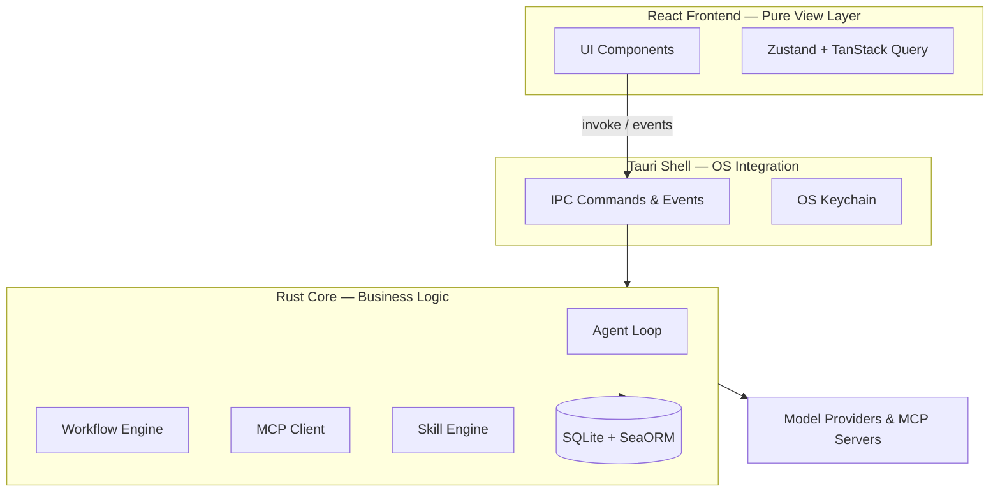

<p align="center">
  
</p>

**Ship faster with AI — without sending your code to anyone.**

We help developers who worry about pasting proprietary code into cloud AI run coordinated multi-agent workflows locally, so they can leverage AI's full potential without compromising privacy.

<div style="display: flex; flex-wrap: wrap; gap: 6px; justify-content: center; align-items: center;">
  
  
  
  
  
  
  
  
</div>

---

## What is SkillDeck?

SkillDeck is a **local‑first, native desktop AI orchestration platform** for developers. It brings multi‑agent workflows, filesystem‑based skills, and the Model Context Protocol (MCP) into a single Tauri 2 application — so your code, prompts, and API keys never leave your machine.

Unlike cloud‑based AI assistants, SkillDeck treats your AI workflow as part of your codebase: skills are version‑controllable Markdown files, workflows are declarative DAGs, and every tool call is transparent and approval‑gated.

> [!NOTE]
> Built with a Rust core, React frontend, and SQLite storage. Zero Electron. Zero cloud dependency. Optional cloud features are strictly opt‑in.

---

## Features

- **Branching Conversations** — explore multiple solutions from any message without losing context; navigate and compare branches side‑by‑side.
- **Multi‑Agent Workflows** — Sequential, Parallel, and Evaluator‑Optimizer orchestration patterns, visualized as interactive DAGs.
- **Filesystem‑Based Skills** — reusable `SKILL.md` packages with YAML frontmatter, priority resolution (workspace > personal > registry), and built‑in linting.
- **MCP Integration** — full Model Context Protocol client (stdio + SSE transports, JSON‑RPC 2.0, protocol `2024-11-05`) with supervision and automatic restarts.
- **Tool Approval Gates** — risk‑based approval for every external tool call; approve, edit parameters, or deny.
- **Multi‑Provider** — Claude, OpenAI, and Ollama (local) with per‑profile model selection and parameters.
- **Local‑First Storage** — SQLite with WAL mode; API keys stored in the OS keychain (macOS Keychain, Windows Credential Manager, libsecret).
- **Reactive Streaming** — ring buffer → 50 ms debounce → IPC → `requestAnimationFrame` for silky‑smooth token rendering.
- **TOON Encoding** — structured data sent to LLMs uses TOON (Token‑Oriented Object Notation), reducing token usage by ~40 % compared to JSON.

---

## Architecture

SkillDeck is architected as a **Reactive, Event‑Driven State Machine** with three distinct layers:


```mermaid
graph TB
    subgraph Frontend["React Frontend — Pure View Layer"]
        UI[UI Components]
        State[Zustand + TanStack Query]
    end

    subgraph Shell["Tauri Shell — OS Integration"]
        IPC[IPC Commands & Events]
        Keychain[OS Keychain]
    end

    subgraph Core["Rust Core — Business Logic"]
        Agent[Agent Loop]
        Workflow[Workflow Engine]
        MCP[MCP Client]
        Skill[Skill Engine]
        DB[(SQLite + SeaORM)]
    end

    UI -- invoke / events --> IPC
    IPC --> Core
    Core --> DB
    Core --> External[Model Providers & MCP Servers]
```

### The Three Layers

| Layer | Crate / Package | Responsibility |
|-------|-----------------|----------------|
| **Rust Core** | `skilldeck-core` | Agent loop, context builder, tool dispatcher, model providers, MCP client, skill loader/resolver/watcher, workflow executor, workspace detection. **Zero Tauri dependencies.** |
| **Tauri Shell** | `src-tauri` | IPC commands, event bridging, OS keychain integration, window management, approval‑gate queue. Thin — no business logic. |
| **React Frontend** | `src` | Pure UI. State via Zustand, server state via TanStack Query, routing via TanStack Router, components via shadcn/ui. |

> [!TIP]
> Because `skilldeck-core` has no Tauri dependency, it’s fully testable in isolation and portable to CLI or server contexts.

### The Agent Loop

At the heart of SkillDeck is a streaming async loop:

1. Save the user message to SQLite.
2. Build context (conversation history + active skills + workspace files).
3. Call the configured model provider.
4. Stream tokens: ring buffer → 50 ms debounce → IPC events.
5. Dispatch tool calls (built‑in or MCP) through the approval gate.
6. Persist the assistant message and emit a `done` event.
7. Auto‑process the next queued message, if any.

---

## Tech Stack

| Layer | Technologies |
|-------|--------------|
| **Core** | Rust (Edition 2024), Tokio, SeaORM 2, Petgraph, Notify, Reqwest, Tracing |
| **Shell** | Tauri 2, `tauri-plugin-shell`, `tauri-plugin-keyring`, `tauri-plugin-store` |
| **Frontend** | React 19, TypeScript, Vite 8, Tailwind CSS 4, shadcn/ui (Radix primitives) |
| **State** | Zustand (UI state), TanStack Query (server state) |
| **Routing** | TanStack Router |
| **Workflows** | `@xyflow/react` (React Flow) for DAG visualization; `petgraph` for execution |
| **Database** | SQLite (WAL mode) with optional vector search (`sqlite-vss`) |
| **Testing** | Rust: `cargo test` + `nextest`; Frontend: Vitest (unit + browser) + Playwright |
| **Tooling** | Biome (lint + format), Lefthook (git hooks), Commitlint, CSpell, Lingui (i18n) |

---

## Getting Started

### Prerequisites

- [Rust](https://rustup.rs/) (stable, Edition 2024)
- [Node.js](https://nodejs.org/) v20 or later
- [pnpm](https://pnpm.io/) v10 or later
- [Tauri prerequisites](https://tauri.app/start/prerequisites/) for your platform
- (Optional) [Ollama](https://ollama.com) for local models

### Quick Start

```bash
# Clone the repository
git clone https://github.com/elcoosp/skilldeck.git
cd skilldeck

# Install frontend dependencies
pnpm install

# Launch with hot-reloading
pnpm tauri dev
```

The app launches and you’re ready to create your first conversation.

> [!NOTE]
> On first launch, SkillDeck runs database migrations and seeds default data (a default profile, model pricing entries, and skill source directories).

### Build for Production

```bash
pnpm build          # Build the frontend
pnpm tauri:build    # Build native installers (MSI, DMG, AppImage)
```

---

## Project Structure

```
skilldeck/
├── src/                          # React frontend (kebab-case files)
│   ├── components/               # UI components (shadcn/ui + custom)
│   │   ├── conversation/         # Message thread, branches, tool cards
│   │   ├── layout/               # Three-panel shell
│   │   ├── right-panel/          # Session, Workflow, Analytics tabs
│   │   ├── skills/               # Marketplace, install, lint panels
│   │   └── ui/                   # shadcn primitives (do not edit)
│   ├── hooks/                    # TanStack Query & event hooks
│   ├── store/                    # Zustand stores
│   ├── lib/                      # IPC wrappers, events, utils
│   └── routes/                   # TanStack Router routes
│
├── src-tauri/                    # Tauri shell + Rust workspace
│   ├── skilldeck-core/           # Pure Rust library (no Tauri dependency)
│   │   └── src/
│   │       ├── agent/            # Agent loop, context builder, tools
│   │       ├── mcp/              # MCP client, transports, supervisor
│   │       ├── providers/        # Claude, OpenAI, Ollama
│   │       ├── skills/           # Loader, resolver, watcher, scanner
│   │       ├── workflow/         # DAG executor, pattern runners
│   │       ├── workspace/        # Project detection, context loading
│   │       ├── traits/           # ModelProvider, McpTransport, …
│   │       ├── db/               # SeaORM connection + migrations
│   │       └── toon.rs           # TOON encoding wrapper
│   ├── skilldeck-models/         # Shared SeaORM entities (50+ tables)
│   ├── migration/                # Database migrations
│   └── src/                      # Tauri commands, AppState, keychain
│
├── skilldeck-lint/               # Skill linting engine (CLI + library)
│   └── src/
│       ├── rules/                # 17 lint rules across 4 categories
│       └── bin/main.rs           # `skilldeck-lint` CLI
│
├── skilldeck-platform/           # Optional cloud backend (Axum)
│   └── src/
│       ├── core/                 # Registration, API keys
│       ├── growth/               # Referrals, nudges, activity events
│       ├── preferences/          # User preferences
│       └── skills/               # Registry, enrichment, lint cron
│
├── skilldeck-user-docs/          # Documentation site (Astro Starlight)
├── skilldeck-landing/            # Marketing landing page (Next.js)
├── skilldeck-marketing-assets/   # Screenshot/video capture (Playwright)
│
├── docs/                         # Specs, design docs, reports
│   ├── spec/                     # SRS, BRS, architecture, vision
│   ├── design/                   # UX, tech stack, project structure
│   └── reports/                  # Audit, growth, code-smell reports
│
├── ARCHITECTURE.md               # High-level architecture overview
├── CODE_OF_CONDUCT.md
├── CONTRIBUTING.md
├── SECURITY.md
└── LICENSE.md                    # MIT OR Apache-2.0
```

---

## Core Concepts

### Skills

Skills are directories containing a `SKILL.md` file with YAML frontmatter. They’re injected into the agent’s context and can be version‑controlled like any other code.

```yaml
---
name: code-review
description: "Review code for bugs, security issues, and style violations"
compatibility: ["claude-3", "gpt-4"]
allowed_tools: ["read_file", "list_directory"]
---

# Code Review

## Instructions
1. Read the target file.
2. Check for null‑access patterns and missing error handling.
3. Report findings grouped by severity (HIGH / MED / LOW).
```

Skills are resolved by priority:

1. **Workspace** — `./.skilldeck/skills/`
2. **Personal** — `~/.agents/skills/`
3. **Registry** — cached from the SkillDeck Platform

The built‑in linter (`skilldeck-lint`) runs **17 rules** across frontmatter, structure, security, and quality categories, producing a security score and quality score (1–5).

### MCP (Model Context Protocol)

SkillDeck implements the full MCP specification (JSON‑RPC 2.0, protocol `2024-11-05`) with:

- **stdio transport** — spawns local MCP servers as subprocesses.
- **SSE transport** — connects to remote MCP servers over HTTP.
- **Supervision** — health checks every 30 s and exponential‑backoff restarts (1 s → 2 s → 4 s → … max 60 s, max 5 attempts).
- **Tool registry** — aggregates tools from all connected servers.
- **Approval gate** — every external tool call is gated by default (all six auto‑approve categories are off by default).

### Workflows

Three execution patterns for multi‑step tasks:

| Pattern | When to use |
|---------|-------------|
| **Sequential** | Each step depends on the previous one; steps run in topological order. |
| **Parallel** | Independent steps run concurrently using Tokio’s `JoinSet`. |
| **Evaluator‑Optimizer** | Iterative refinement loop; generator produces, evaluator scores, repeat until threshold or max iterations. |

Workflows are defined as DAGs, validated with `petgraph` (cycle detection), visualized with React Flow, and executed with real‑time step tracking.

### Agent Loop

The agent loop is the heart of the system:

1. Persist user message.
2. Build context (history + active skills + workspace).
3. Call model provider (streaming).
4. Emit `agent:token` events (50 ms debounce).
5. Dispatch tool calls (built‑in or MCP).
6. Await approval if required (non‑blocking oneshot channel).
7. Persist assistant message; emit `done`.

---

## Development

### Common Commands

```bash
# Frontend
pnpm dev              # Vite dev server only
pnpm build            # Build frontend
pnpm lint             # Biome check
pnpm format           # Biome format
pnpm typecheck        # TypeScript check
pnpm test             # Vitest (unit + browser)
pnpm test:coverage    # Coverage report

# Rust
cargo test --workspace
cargo clippy --workspace -- -D warnings
cargo fmt --all -- --check

# Tauri
pnpm tauri dev        # Dev with hot-reload
pnpm tauri:build      # Production build
```

### Testing

| Layer | Tool | Command |
|-------|------|---------|
| Rust core | `cargo test` + `nextest` | `cargo nextest run` |
| Frontend units | Vitest (happy‑dom) | `pnpm test:coverage:unit` |
| Frontend components | Vitest (browser mode) | `pnpm test` |
| E2E | Playwright + `tauri-driver` | `cd e2e-tests && pnpm test` |

### Linting & Formatting

- **Rust**: `rustfmt` + `clippy` (warnings as errors in CI).
- **TS / TSX / JSON / CSS**: Biome (replaces ESLint + Prettier).
- **Git hooks**: Lefthook (runs Biome + CSpell on staged files).
- **Commit messages**: Commitlint (Conventional Commits).

---

## Configuration

| What | Where |
|------|-------|
| API keys | OS keychain — macOS Keychain, Windows Credential Manager, libsecret |
| Database | `~/.local/share/skilldeck/skilldeck.db` (platform‑specific) |
| Lint config (global) | `~/.config/skilldeck/skilldeck-lint.toml` |
| Lint config (workspace) | `<workspace>/.skilldeck/skilldeck-lint.toml` |
| Personal skills | `~/.agents/skills/` |
| Workspace skills | `<workspace>/.skilldeck/skills/` |
| Panel layout | Persisted in `localStorage` under `skilldeck-panel-layout` |

---

## Documentation

- **User documentation** → [docs.skilldeck.dev](https://docs.skilldeck.dev) (built with Astro Starlight)
- **Architecture overview** → [ARCHITECTURE.md](ARCHITECTURE.md)
- **Specifications** → [`docs/spec/`](docs/spec/) — vision, BRS, SRS, architecture, test verification
- **Design documents** → [`docs/design/`](docs/design/) — UX, tech stack, project structure, v2 roadmap
- **Skill format** → [agentskills.io](https://agentskills.io)
- **Security policy** → [SECURITY.md](SECURITY.md)

---

## Status

SkillDeck is in **beta**. Core features are complete and the app is usable for daily work. Remaining focus areas:

- Stability and edge‑case hardening.
- Skill ecosystem growth (registry, sharing, linting).
- Advanced workflow patterns (Map‑Reduce, DAG merging).
- Team features (shared skill libraries, enterprise controls).

See the [v2 roadmap](docs/design/v2-roadmap.md) for the full plan through 2026.

---

<p align="center">
  <strong>Your code stays yours. Your agents work for you.</strong><br/>
  <sub>Built with care by developers who believe in local‑first AI.</sub>
</p>
