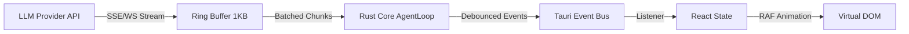

I will invoke **Dr. Quinn** (Creative Problem Solver) from the BMAD Creative Intelligence Suite to diagnose and resolve these architectural complexities systematically. This requires a "Sherlock meets scientist" approach—applying systems thinking and root cause analysis to clarify the deep technical interactions in SkillDeck.

---

# SkillDeck Architecture Clarification Document

**Prepared by:** Dr. Quinn (BMAD-CIS Problem Solver)
**Methodology:** Systems Thinking & Constraints Analysis
**Status:** Resolved — Implementation Ready

## Executive Summary

This document resolves 10 critical architectural ambiguities in the SkillDeck system. The core insight is that SkillDeck is a **Reactive, Event-Driven State Machine** wrapped in a desktop shell. The primary constraint is the **IPC Boundary** between Rust (source of truth) and React (projection). All solutions below optimize for data integrity across this boundary while maintaining a fluid UX.

---

## 1. Agent Loop & Streaming Architecture

### The Diagnosis

The core problem is **backpressure management**: the LLM generates tokens faster than the UI can render them, and the IPC bridge can become a bottleneck if flooded with micro-events.

### The Resolution: Tiered Streaming Pipeline

We implement a three-tier flow control system:



**Rust Side (Producer):**

- **Ring Buffer**: The `AgentLoop` accumulates tokens into a `String` buffer.
- **Debounced Emission**: Instead of `emit("agent:token", chunk)` per token, we batch every **50ms** (configurable) or **10 tokens**, whichever comes first.
- **Payload Structure**:
  ```rust
  // Event: agent:token
  pub struct TokenPayload {
      pub conversation_id: Uuid,
      pub message_id: Uuid,
      pub delta: String,      // Accumulated text since last emit
      pub is_final: bool,     // True when stream ends
  }
  ```

**React Side (Consumer):**

- **Event Listener**: `use-agent-stream.ts` listens to `agent:token`.
- **State Update**: Appends `delta` to a local Zustand store (`streamingText`).
- **Rendering**: The `<MessageBubble />` component uses `react-markdown` with a "streaming" prop that renders partial markdown gracefully.
- **Performance Guard**: If the React render cycle drops frames, the event listener automatically throttles (drops intermediate deltas) to keep the UI responsive.

---

## 2. Tool Approval Gate Mechanism

### The Diagnosis

The agent loop must **pause** without blocking the Tokio runtime, wait for an asynchronous user action, and then resume with the decision. This requires a synchronization primitive that bridges the synchronous agent loop logic with the asynchronous UI event loop.

### The Resolution: One-Shot Channel Gate

We use `tokio::sync::oneshot` to create a "pause point" in the agent loop.

**Rust Implementation:**

```rust
// In skilldeck-core/agent/loop.rs
use tokio::sync::oneshot;

pub struct ApprovalGate {
    pub tool_call_id: Uuid,
    pub tool_name: String,
    pub input_json: Value,
    pub response_tx: oneshot::Sender<ApprovalDecision>, // The "unpause" trigger
}

// Inside the agent loop:
let (tx, rx) = oneshot::channel();
let gate = ApprovalGate { tool_call_id, ..., response_tx: tx };

// 1. Pause execution
self.event_emitter.emit("agent:approval_required", gate).await;

// 2. Wait for UI (non-blocking to runtime, but blocks this specific task)
match rx.await {
    Ok(ApprovalDecision::Approved(modified_input)) => { /* continue */ },
    Ok(ApprovalDecision::Denied) => { /* inject error tool result */ },
    Err(_) => { /* timeout or UI closed */ },
}
```

**Tauri Bridge:**

- The `ApprovalGate` struct is serialized and sent to React.
- **Crucially**, `response_tx` cannot be serialized. Instead, we store it in a `DashMap<Uuid, oneshot::Sender>` in `AppState`.
- React calls `invoke('submit_approval', { tool_call_id, decision })`.
- The Tauri command retrieves the sender from the map and fires the signal, unpausing the loop.

---

## 3. Subagent Context Isolation

### The Diagnosis

A subagent is not a separate process; it is a **forked logical context** within the same runtime. The risk is "context bleeding" where the subagent sees parent messages it shouldn't, or modifies parent state.

### The Resolution: Scoped Context & Message Forking

**Context Construction:**
When `spawnSubagent` is called:

1. **Fork Messages**: We do _not_ copy all parent messages. We create a _new_ temporary conversation context containing only:
   - The `SpawnSubagent` prompt as the "System/User" context.
   - A copy of the relevant `Skill` manifests.
   - A **snapshot** of the relevant Tool Schemas.
2. **Session ID**: The subagent operates under a `subagent_id` (UUID). All DB inserts (messages, tool calls) are tagged with this ID.

**State Isolation:**

- The subagent runs in a separate `tokio::task`.
- It shares the `DatabaseConnection` but uses distinct `conversation_id` (temporary) and `subagent_id` for all queries.
- **Memory Guards**: The subagent has its own `TokenCounter`. If it exceeds its budget, it halts.

**Merge Process:**

- When `MergeSubagentResults` is called, we read all messages tagged with `subagent_id`.
- We apply the merge strategy (`concat`, `summarize`, `first_wins`).
- We insert the _final result_ as a new message in the _parent_ conversation.
- We then delete the temporary conversation rows (or soft-delete/archive them for debugging).

---

## 4. Workflow DAG Execution Model

### The Diagnosis

Workflows require topological sorting and concurrent execution management. The system must handle dependencies (A waits for B) and fan-out/fan-in (B & C run parallel, D waits for both).

### The Resolution: Petgraph State Machine

**Graph Construction:**
We map the YAML workflow config to a `petgraph::DiGraph<WorkflowStep, ()>`.

- **Nodes**: Individual steps (Agent, Evaluator, Aggregator).
- **Edges**: Dependencies.

**Executor Logic:**

```rust
pub struct WorkflowExecutor {
    graph: DiGraph<WorkflowStep, ()>,
    state: DashMap<Uuid, StepStatus>, // StepID -> Status
}

impl WorkflowExecutor {
    pub async fn run(&self) {
        // Initial ready set: nodes with in-degree 0
        let mut ready = self.get_ready_nodes();

        while !ready.is_empty() {
            // Fan-out: spawn all ready tasks concurrently
            let mut tasks = JoinSet::new();
            for node_id in ready.drain(..) {
                tasks.spawn(self.execute_step(node_id));
            }

            // Fan-in: wait for batch to complete
            while let Some(result) = tasks.join_next().await {
                let completed_id = result.unwrap();
                self.update_status(completed_id, Completed);

                // Check if new nodes are ready (in-degree satisfied)
                let new_ready = self.get_dependents(completed_id)
                    .filter(|dep| self.all_dependencies_met(*dep));
                ready.extend(new_ready);
            }
        }
    }
}
```

**Evaluator-Optimizer Loop:**
This is a specialized sub-graph with a back-edge (cycle handled by iteration counter):

1. Run Generator.
2. Run Evaluator.
3. If `score < threshold` AND `iterations < max`: feed feedback to Generator, increment counter, repeat.
4. Else: Break loop, proceed to next step.

---

## 5. TOON vs JSON Boundary

### The Diagnosis

TOON is for the LLM (token efficiency). JSON is for the Database/IPC (interoperability). The conversion must happen exactly once at the LLM boundary.

### The Resolution: Boundary Encoding Pattern

**Storage & IPC Layer (JSON):**

- Database stores tool schemas, results, and messages in **JSONB**.
- Tauri Commands pass data as **JSON** (serde_json).

**Prompt Assembly Layer (TOON):**

- The `ContextBuilder` constructs the prompt string.
- When injecting structured data (tools, context, history), it calls `toon_format::encode(data)`.
- The resulting string is wrapped in markdown code blocks for the LLM.

**The Flow:**

1. Frontend requests agent turn (JSON over IPC).
2. Rust Core loads context (JSON from DB).
3. `ContextBuilder` converts JSON -> TOON string.
4. Prompt sent to Model Provider (TOON string).
5. Model returns text.
6. Tool calls parsed (if JSON format) or extracted (if TOON format).
7. Tool results stored in DB (JSON).
8. Rust Core streams raw text to Frontend.

**Fallback Logic:**

```rust
let prompt = if self.provider.toon_supported() {
    toon_encode(&context)
} else {
    json_encode(&context) // Fallback for "stupid" models
};
```

---

## 6. MCP Server Lifecycle

### The Diagnosis

MCP servers are external processes (stdio) or HTTP services (SSE). They can crash, hang, or disconnect. The agent must be resilient to these failures.

### The Resolution: Supervision Tree

**Process Management:**

- `tauri-plugin-shell` spawns the child process.
- We wrap the process handle in a `Supervisor` struct.
- **Healthcheck Loop**: A background task pings the server every 30s (MCP `ping` method).

**Failure Handling:**

1. **Crash Detection**: The `wait()` future on the child process resolves.
2. **State Update**: The `McpRegistry` marks the server as `Disconnected`.
3. **Agent Notification**: If a tool call to this server is pending, it returns a `TransportError`.
4. **UI Toast**: Event `mcp:disconnected` is emitted.
5. **Auto-Reconnect**: Supervisor attempts restart with exponential backoff (3 attempts).

**Tool Schema Cache:**

- On successful connection, we call `tools/list` and store results in `mcp_tool_cache`.
- If server disconnects, we keep the cache (grayed out in UI).
- On reconnect, we diff the new schema; if changed, we emit `mcp:tools_updated`.

---

## 7. Branch Tree Implementation

### The Diagnosis

A conversation is a tree, but the UI displays a linear thread. We need efficient queries to extract a "slice" of the tree for a specific branch.

### The Resolution: Recursive CTE + Adjacency List

**Database Schema:**

- `messages` table has `parent_id` (adjacency list model).
- `conversation_branches` table stores named "tips" (pointers to leaf nodes).

**Query Strategy (SQLite):**
We use a **Recursive Common Table Expression (CTE)** to fetch the active branch.

```sql
WITH RECURSIVE active_branch AS (
    -- Anchor: The tip of the active branch
    SELECT * FROM messages WHERE id = (SELECT tip_message_id FROM conversation_branches WHERE is_active = TRUE)

    UNION ALL

    -- Recursive member: Walk up the tree
    SELECT m.* FROM messages m
    INNER JOIN active_branch ab ON m.id = ab.parent_id
)
SELECT * FROM active_branch ORDER BY created_at ASC;
```

**UI Navigation:**

- When user clicks a branch pill, we update `conversation_ui_state.active_branch_id`.
- The `use-messages` hook re-runs the query with the new tip ID.
- The UI re-renders the thread linearly.

---

## 8. Skill Resolution & Hot Reloading

### The Diagnosis

Filesystem changes must be reflected in the app immediately without restarting. Race conditions can occur if a file is read while being written.

### The Resolution: Event-Driven Scanner

**Watcher Setup:**

- `notify` crate watches all directories in `skill_source_dirs`.
- Events: `Create`, `Modify`, `Remove`.

**Resolution Pipeline:**

1. **Debounce**: Events are debounced by 200ms to handle editor atomic writes (write to temp, rename).
2. **Scan**: On valid event, parse the `SKILL.md`.
3. **Shadow Resolution**: Check if this skill name exists in a higher-priority directory.
   - If yes: Mark this skill as `is_shadowed = true`.
   - If no: Mark this skill as `active`.
   - Update any previously active skills with same name to `shadowed = true`.
4. **DB Sync**: Upsert `skills` table.
5. **Event**: Emit `skill:scan_complete`.

**Load Balancing:**
The resolver maintains an in-memory `Arc<RwLock<SkillRegistry>>`. The agent loop reads from this registry. Filesystem scanning happens in a separate task, updates the lock atomically.

---

## 9. Error Propagation Across Layers

### The Diagnosis

Errors happen in Rust, but the user experiences them in React. We need semantic error types that survive the IPC serialization boundary.

### The Resolution: Structured Error Envelope

**Rust Error Taxonomy:**

```rust
pub enum CoreError {
    // Recoverable: Agent can try again or use fallback
    ToolFailed { tool_name: String, error: String },

    // User Intervention Required: Approval, auth, etc.
    ApprovalRequired { gate: ApprovalGate },

    // Fatal: Conversation must stop
    ModelOverloaded { retry_after: Option<u64> },
    ContextLimitExceeded { current: usize, max: usize },
}
```

**IPC Transport:**
These errors are serialized into a standard JSON format:

```json
{
  "type": "ToolFailed",
  "message": "read_file permission denied",
  "recoverable": true,
  "context": { "tool_name": "read_file" }
}
```

**React Handling:**

- **Recoverable**: Show inline error card with "Retry" button.
- **Intervention**: Show approval dialog.
- **Fatal**: Pause agent, show error toast, log to file.

---

## 10. Testing the IPC Boundary

### The Diagnosis

Testing Tauri apps is hard because of the Rust/JS split. Mocking `invoke` is brittle.

### The Resolution: Layered Testing Strategy

**Unit Tests (Rust Core):**

- No Tauri involved.
- Mock `ModelProvider`, `McpTransport` using traits.
- Test business logic (DAG execution, TOON encoding) in isolation.

**Integration Tests (IPC Mocking):**

- **Frontend**: Use a custom mock for the `api` object in `src/lib/invoke.ts`.
  ```typescript
  // tests/mocks/api.ts
  export const api = {
    get_conversations: jest.fn(() => Promise.resolve(mockConversations)),
    send_message: jest.fn(() => Promise.resolve(mockStreamEvent)),
  };
  ```
- **Backend**: Use `tauri::test::MockRuntime` (if available) or run a minimal headless Tauri instance for critical path tests.

**E2E Tests (Tauri WebDriver):**

- Launch the actual app binary.
- Test user flows: "Login -> New Chat -> Message -> Receive Response".
- Verify database state by reading the SQLite file directly.

---

## Conclusion

By resolving these 10 points, SkillDeck transforms from a "monolithic desktop app" into a **cohesive system of interacting state machines**. The primary architectural wins are:

1.  **Non-blocking supervision** (Agent Loop & MCP).
2.  **Serialized boundaries** (IPC & TOON/JSON).
3.  **Graph-based orchestration** (Workflows).

This clarifies the implementation path for v1.
