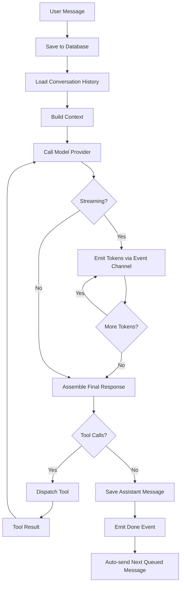

import Feedback from '../../../../components/mdx/Feedback.astro';

When you send a message in SkillDeck, it goes through a multi‑step process called the **agent loop**. This loop orchestrates the conversation, injects relevant context, calls the model, handles tool calls, and streams the response back to you.

## High‑Level Flow

## Step‑by‑Step Breakdown

### 1. User Message Received
When you hit Enter, the message is immediately saved to the local SQLite database. This ensures you never lose a conversation, even if the app crashes mid‑response.

### 2. Load Conversation History
The agent loop loads the relevant conversation history – up to a configurable limit (default 100 messages). If you're in a branch, only messages from that branch are loaded.

### 3. Context Builder
The context builder assembles the full prompt for the model. It combines:
- System prompt (configured per profile)
- Any loaded skill content (skills injected via `loadSkill` tool or available in the registry)
- Conversation history
- Tool definitions (from MCP servers and built‑in tools)

### 4. Model Call
A request is sent to the model provider (Claude, OpenAI, Ollama, etc.) with the assembled context. The request includes:
- The model ID (e.g., `claude-sonnet-4-5`)
- The messages array
- Optional tool definitions
- Model parameters (temperature, max tokens, etc.)

### 5. Streaming
Responses are streamed in real time. Each token is sent to the frontend via a Tauri event (`agent-event` with type `token`). The UI accumulates these tokens and displays them incrementally.

### 6. Tool Handling
If the model decides to call a tool (e.g., `read_file`, `spawnSubagent`), the loop pauses and dispatches the tool call:
- Built‑in tools are handled directly by the agent.
- MCP tools are sent to the appropriate MCP server.
- Tool calls may require user approval (if not auto‑approved). The approval gate suspends the loop until the user responds.

The tool result is then fed back to the model, and the loop continues.

### 7. Completion
When the model finishes (no more tokens or tool calls), the final assistant message is saved to the database. A `done` event is emitted with token usage statistics.

### 8. Queue Processing
After the current message is complete, the agent checks if there are any queued messages for this conversation. If yes, the next queued message is sent automatically.

## Configuration Options

The agent loop can be tuned via the `[agent]` section in `config.toml`:

| Key | Type | Default | Description |
|-----|------|---------|-------------|
| `max_eval_opt_iterations` | integer | `5` | Maximum iterations in evaluator‑optimizer workflows. |
| `debounce_ms` | integer | `50` | Time (ms) to buffer tokens before sending to UI. |
| `max_context_messages` | integer | `100` | Number of messages to keep in context window. |

## Related

- [Workflows Explanation](/en/explanation/workflows)
- [MCP Supervisor Explanation](/en/explanation/mcp-supervisor)
- [Skill Resolution](/en/explanation/skill-resolution)

<Feedback />
